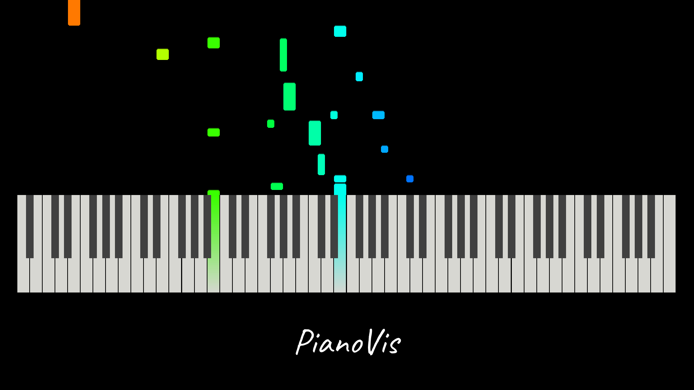

# PianoVis 0.2.1

A Python piano video exporter.

Examples:
* [Papillon (Grieg)](https://www.youtube.com/watch?v=mUAQ6-2oa2w)
* [Impromptu Rosamunde (Schubert)](https://www.youtube.com/watch?v=y0lmpqP2AGY)
* [Sonatina (Clementi)](https://www.youtube.com/watch?v=kfebLsnU1qE)

<br>


## Quick Start

1. Install PianoVis: `pip install piano-vis`
    * Dependencies:
        * pygame
        * opencv-python
        * mido
        * colorama
        * vext (optional, for playing sound during preview)
        * vext.gi (optional, for playing sound during preview)
        * playsound (optional, for playing sound during preview)
        * win10toast (only on Windows)
2. Follow this code format:
```python3
import pianovis

resolution = (1920, 1080)
fps = 30
offset = 1

vid = pianovis.Video(resolution, fps, offset)
vid.add_midi("midi1.mid")
vid.add_midi("midi2.mid")
vid.set_audio("audio.mp3")
vid.export("video.mp4")
```

<br>


## pianovis.Video

`pianovis.Video` is the main video class which stores all midi and audio files, and exports the final video.
* `Video.__init__(resolution: Tuple[int, int], fps: int, offset: int) -> None`
    * Initializes video.
    * `resolution`: (x, y) pixel resolution of video.
    * `fps`: FPS (frames per second) of video.
    * `offset`: Offset (frames) of video from audio. Usually, a value of 1 makes the video look lined up with the audio.
    * `decor_surf`=None Decoration surface, blitted under the piano.
* `Video.configure(path: str, value: Any) -> None`
    * Sets an option for the video (read more in the Customization section).
    * `path`: Option path.
    * `value`: Value to set path to.
* `Video.add_midi(path: str) -> None`
    * Appends path to midi list.
    * `path`: Midi file path.
* `Video.set_audio(path: str) -> None`
    * Sets audio file to path.
    * `path`: Audio file path.
* `Video.preview(resolution: Tuple[int, int] = (1600, 900), show_meta: bool = True) -> None:`
    * Opens a pygame window to preview the animation.
    * `resolution`=(1600, 900): Resolution of pygame window.
    * `show_meta`=True: Show metadata in the corner of window.
    * `audio`=True: Play audio along preview.
* `Video.export(self, path: str, multicore: bool = False, max_cores: int = multiprocessing.cpu_count(), notify: bool = False) -> None:`
    * Exports video to path.
    * `path`: Path to export (mp4)
    * `multicore`=False: Use multiple cores to export. Can be faster, but will take more power.
    * `max_cores`=multiprocessing.cpu_count(): Maximum cores to use. Only relevant if using multicore.
    * `notify`=False: Sends notification when done exporting. Requires `win10toast` on Windows.

<br>


## Customization

Run `Video.configure` to change options.
* `keys.white.gap`: Gap (pixels) between white keys.
* `keys.white.color`: Color (RGB) of white keys.
* `keys.black.width_fac`: Factor of white key width.
* `keys.black.height_fac`: Factor of white key height.
* `keys.black.color`: Color (RGB) of black keys.
* `blocks.speed`: Speed (pixels per second) of blocks.
* `blocks.border`: Border width (pixels) of blocks.
* `blocks.color_grad`: Color gradient of blocks: ((fac1, hsv1), (fac2, hsv2)...)
* `blocks.color_hue`: Hue adjustment (additive) to color.
* `blocks.color_saturation`: Saturation adjustment (multiplicative) to color.
* `blocks.color_value`: Value adjustment (multiplicative) to color.
* `blocks.color_border`: Color (RGB) of border.
* `blocks.rounding`: Rounding radius of blocks.
* `blocks.motion_blur`: Use motion blur in blocks.
* `blocks.light`: Light up blocks when hit. Still in development.

<br>


## How It Works

* The user adds midis and sets an audio.
* When the user calls `Video.export`, a few things happen:
    * All midis are parsed.
    * Single core:
        * Each frame is rendered with pygame, saved, and encoded with opencv.
        * All temporary files are deleted.
    * Multi core:
        * Each core is assigned a chunk of frames and renders and saves them.
        * Each frame is encoded with opencv.
        * All temporary files are deleted.
    * The audio is combined with video with ffmpeg.

## Extras

#### Constants (`pianovis.constants`)
_Note: pianovis.BLACK == pianovis.constants.BLACK_
* Colors (Normalized HSV)
* Block color gradient presets.

#### App (`pianovis.app`)
* Create piano videos in a GUI.
* Currently version 1 (in development)
* Run `pianovis.app.launch()` to launch the latest version.
